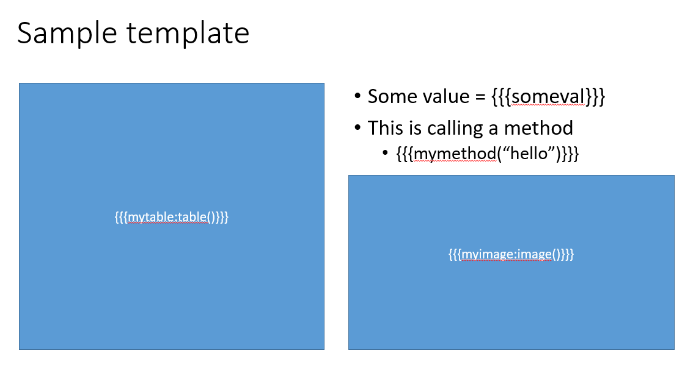
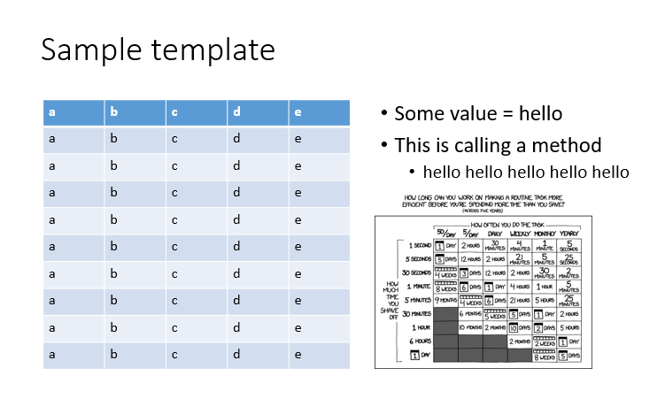

.. pptx_renderer documentation master file

PPTX Renderer
=============

This package let's you run your powerpoint presentations like a jupyter-notebook.
You can insert placeholders in the ppt and also write python code in the ppt's
notes and use either a python function or an equivalent commandline tool to
convert it into an output rendered presentation.

Below is a simple example.

.. code-block:: python

   from pptx_renderer import PPTXRenderer
   p = PPTXRenderer("template.pptx")

   someval = "hello"
   def mymethod(abc):
      return f"{abc} " * 5

   myimage = r"is_it_worth_the_time.png"
   mytable = [["a", "b", "c", "d", "e"]] * 10
   p.render(
      "output.pptx", 
      {
         "someval": someval, "mymethod": mymethod, "myimage": myimage,
         "mytable": mytable,
      }
   )

This will convert this

   
   Input Template PPT

to this.

   
   Output PPT

You can define some functions within the ppt itself by writing python code in
the notes section of slides. And the variables and functions in this code
can be used in the main ppt.

If the template ppt is a self contained python script ie: if it does not require
variable values and function definition to be passed from outside, you can
generate the output ppt directly from the commandline using the following
command.

.. code-block::
   
   pptx-renderer input_template.pptx output_file.pptx

See :ref:`Running from command line`

.. toctree::
   :maxdepth: 2
   :caption: Contents:

   usage
   commandline
   api

Indices and tables
==================

* :ref:`genindex`
* :ref:`modindex`
* :ref:`search`
